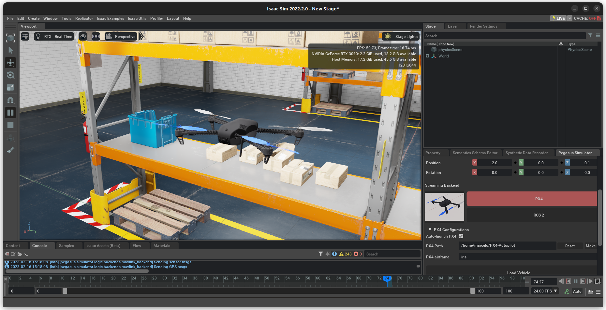
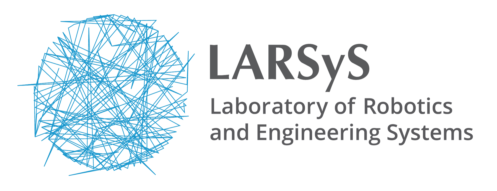
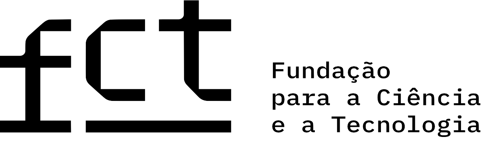

# Pegasus Simulator


**Pegasus Simulator** is a framework built on top of [NVIDIA
Omniverse](https://docs.omniverse.nvidia.com/) and [Isaac
Sim](https://docs.omniverse.nvidia.com/app_isaacsim/app_isaacsim/overview.html). It is designed to provide an easy yet powerful way of simulating the dynamics of vehicles. It provides a simulation interface for [PX4](https://px4.io/) integration as well as a custom python control interface. At the moment, only multirotor vehicles are supported, with support for other vehicle topologies planned for future versions.

<p align = "center">
<a href="https://youtu.be/_11OCFwf_GE" target="_blank"></a>
<a href="https://youtu.be/_11OCFwf_GE" target="_blank"></a>
</p>


Check the provided documentation [here](https://pegasussimulator.github.io/PegasusSimulator/) to discover how to install and use this framework.

## Citation

If you find Pegasus Simulator useful in your academic work, please cite the paper below. It is also available [here](https://arxiv.org/abs/2307.05263).
```
@misc{jacinto2023pegasus,
      title={Pegasus Simulator: An Isaac Sim Framework for Multiple Aerial Vehicles Simulation}, 
      author={Marcelo Jacinto and João Pinto and Jay Patrikar and John Keller and Rita Cunha and Sebastian Scherer and António Pascoal},
      year={2023},
      eprint={2307.05263},
      archivePrefix={arXiv},
      primaryClass={cs.RO}
}
```

## Main Developer Team

This simulation framework is an open-source effort, started by me, Marcelo Jacinto in January/2023. It is a tool that was created with the original purpose of serving my Ph.D. workplan for the next 4 years, which means that you can expect this repository to be mantained, hopefully at least until 2027.

* Project Founder
	* [Marcelo Jacinto](https://github.com/MarceloJacinto), under the supervision of <u>Prof. Rita Cunha</u> and <u>Prof. Antonio Pascoal</u> (IST/ISR-Lisbon)
* Architecture
    * [Marcelo Jacinto](https://github.com/MarceloJacinto)
	* [João Pinto](https://github.com/jschpinto)
* Multirotor Dynamic Simulation and Control
    * [Marcelo Jacinto](https://github.com/MarceloJacinto)
* Example Applications
	* [Marcelo Jacinto](https://github.com/MarceloJacinto)
	* [João Pinto](https://github.com/jschpinto)

Also check the always up-to-date [Github contributors list](https://github.com/PegasusSimulator/PegasusSimulator/graphs/contributors)

## Project Roadmap

An high level project roadmap is available [here](https://pegasussimulator.github.io/PegasusSimulator/source/references/roadmap.html).

## Support and Contributing

We welcome new contributions from the community to improve this work. Please check the [Contributing](https://pegasussimulator.github.io/PegasusSimulator/source/references/contributing.html) section in the documentation for the guidelines on how to help improve and support this project.

* Use [Discussions](https://github.com/PegasusSimulator/PegasusSimulator/discussions) for discussing ideas, asking questions, and requests features.
* Use [Issues](https://github.com/PegasusSimulator/PegasusSimulator/issues) to track work in development, bugs and documentation issues.
* Use [Pull Requests](https://github.com/PegasusSimulator/PegasusSimulator/pulls) to fix bugs or contribute directly with your own ideas, code, examples or improve documentation.

## Licenses

Pegasus Simulator is released under [BSD-3 License](LICENSE). The license files of its dependencies and assets are present in the [`docs/licenses`](docs/licenses) directory.

NVIDIA Isaac Sim is available freely under [individual license](https://www.nvidia.com/en-us/omniverse/download/). 

PX4-Autopilot is available as an open-source project under [BSD-3 License](https://github.com/PX4/PX4-Autopilot).

## Project Sponsors
- Dynamics Systems and Ocean Robotics (DSOR) group of the Institute for Systems and Robotics (ISR), a research unit of the Laboratory of Robotics and Engineering Systems (LARSyS).
- Instituto Superior Técnico, Universidade de Lisboa

The work developed by Marcelo Jacinto and João Pinto was supported by Ph.D. grants funded by Fundação para a Ciência e Tecnologia (FCT).

<p float="left" align="center">
  
   
   
   
   
</p>
